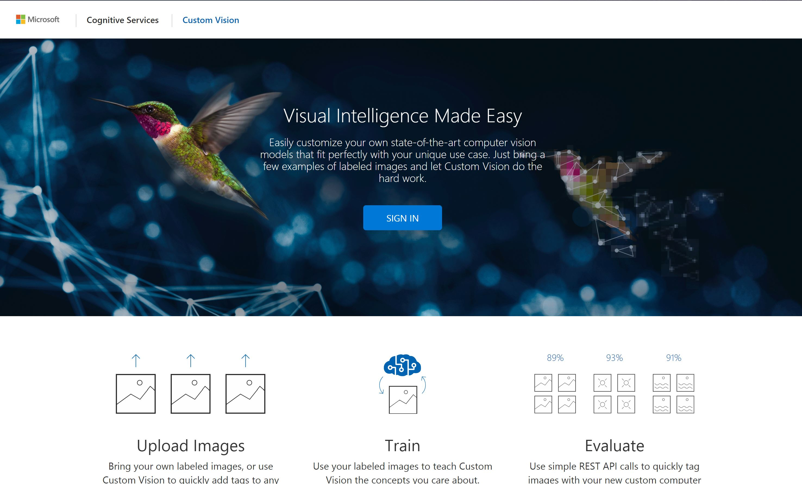
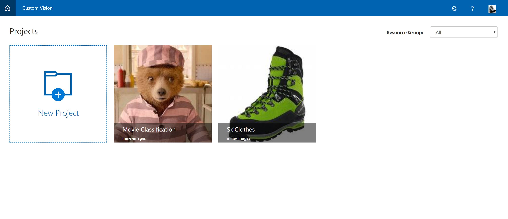
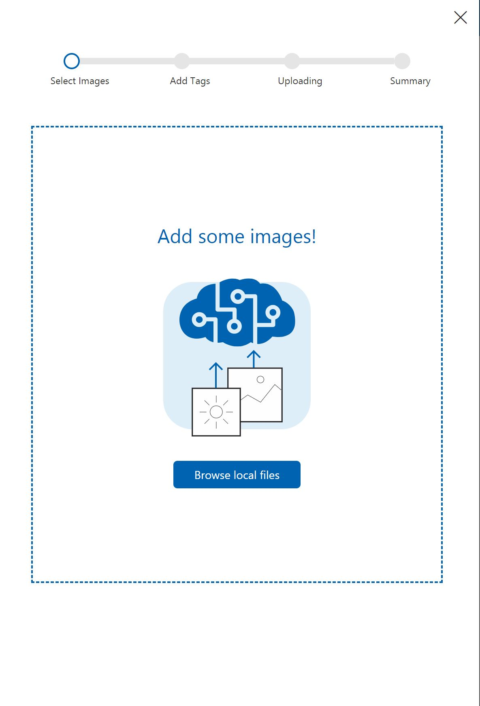
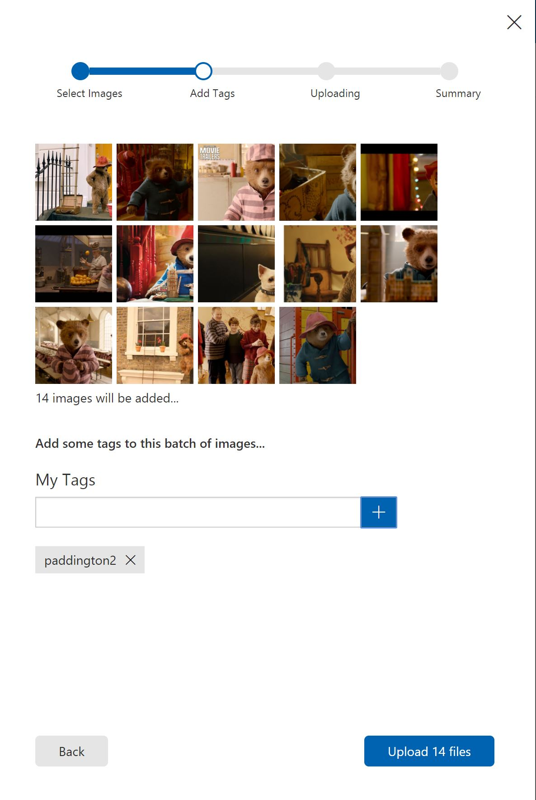
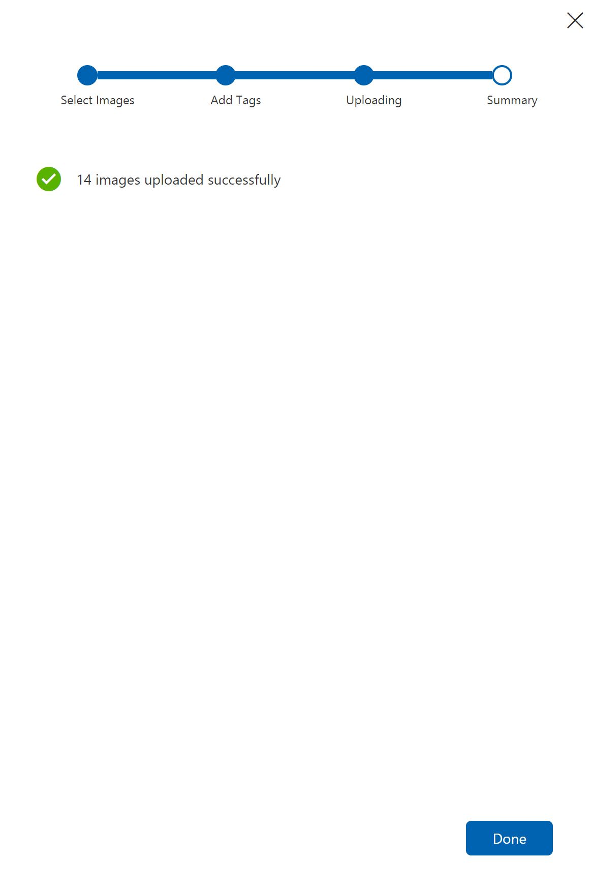
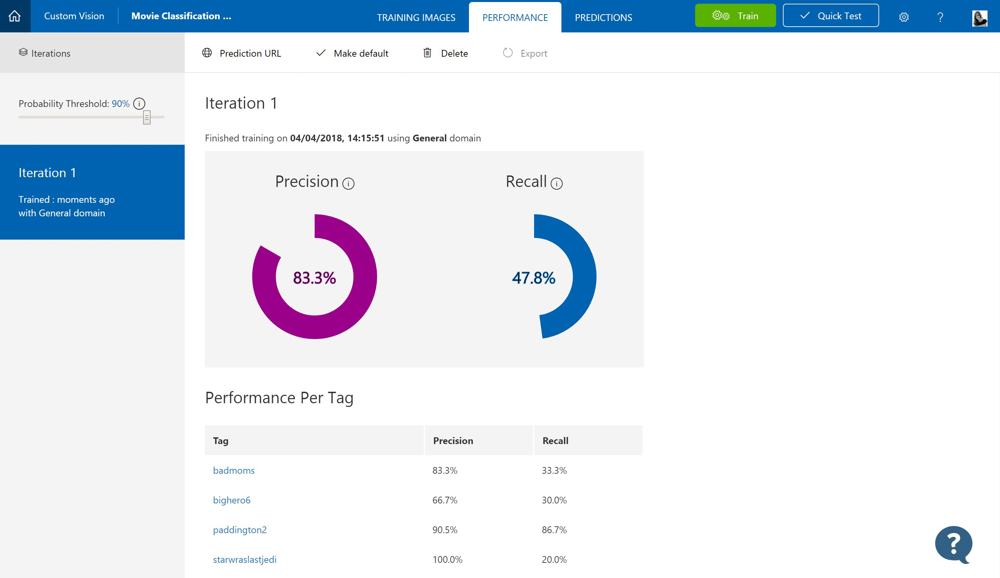
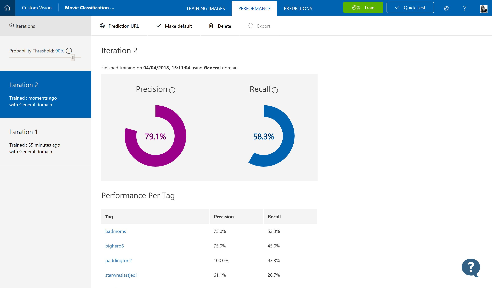

# Azure Cognitive Services with PixStor

This repository will cover how to set up a plugin for [PixStor](https://www.pixitmedia.com/pixstor/) that uses [Microsoft Cognitive Services](https://azure.microsoft.com/en-gb/services/cognitive-services/) to add information about your image archive. The code and contents here are intended as a sample and proof-of-concept only.

# Table of Contents

- [Azure Cognitive Services with PixStor](#azure-cognitive-services-with-pixstor)
- [Repo contents](#repo-contents)
- [Instructions](#instructions)
  * [Azure Computer Vision](#azure-computer-vision)
  * [Azure Custom Vision Service](#azure-custom-vision-service)
    + [Deployment Steps](#deployment-steps)
      - [Create Project](#create-project)
      - [Test the API](#test-the-api)
      - [Retrain the API](#retrain-the-api)
    + [PixStor Plugin](#pixstor-plugin)
  * [Azure Object Detection](#azure-object-detection)
  * [Azure Optical Character Recognition (OCR)](#azure-optical-character-recognition--ocr-)
- [Background](#background)

# Repo contents

- [azurevision.py](azurevision.py)
   - Plugin that uses the Azure [Computer Vision API](https://azure.microsoft.com/en-gb/services/cognitive-services/computer-vision/) to generate a set of tags for the image. This is a generic service and will work on a wide-array of images but it is not designed for specific classification models or problems. This plugin and API is a great first start to using Machine Learning to add information about your image archive.
- [azureclassification.py](azureclassification.py)
  - Plugin that uses the Azure [Custom Vision Service](https://azure.microsoft.com/en-gb/services/cognitive-services/custom-vision-service/). This plugin has a trained model that classifies each image based on the custom trained model. This service is designed to help you answer a specific question about your images, for example "is this a photo of a a wood texture?", or "is this wood grain or chipboard?"
- [azureobjectdetection.py](azureobjectdetection.py)
   - [Object Detection](https://docs.microsoft.com/en-us/azure/cognitive-services/custom-vision-service/python-tutorial-od)

# Instructions

The instructions are split into using the standard Azure Vision API, the Custom Vision service for classification, and the Custom Vision service for object detection. You will need an Azure account to make use of Microsoft Cognitive Services.

You will need an Azure account to use the Cognitive Services APIs. Set up an [Azure account with free credit](https://azure.microsoft.com/en-us/free/) to try this out.

You will need a deployment of PixStor. If you don't have an existing deployment, please contact [PixitMedia](http://www.pixitmedia.com/contact-us/) and they will support you setting up a Virtual Machine with PixStor.

If you don't have PixStor, you can still follow the steps below and test the Azure Cognitive Services, via your own code, service, or in your browser via the [API Console and Explorer](https://westus.dev.cognitive.microsoft.com/docs/services/) (ensure you are using the same region your API key is valid for).

## Azure Computer Vision

This plugin adds metadata to your images based on the standard Azure Computer Vision service. This service will detect information, faces, landmarks, and other general items in your images.

- Set up the vision API in your subscription. You can [start a trial and see your API keys here](https://azure.microsoft.com/en-us/try/cognitive-services/my-apis/). If you have previously set up a trial, you will have to create a vision key in the [Azure Portal](https://portal.azure.com/). Click on ' Create a resource' and search for 'Computer Vision'. Follow the steps in the portal to set up the Computer Vision service.
- Edit the [azurevision.py](azurevision.py) file and change the 'azure_api_key' variable to be your key. Change the variable 'azure_endpoint' to your API endpoint
    - To find your key and API endpoint in the portal click on the resource group you used when creating your Computer Vision service. Then click on the Computer Vision service. If the 'Quick Start' tab hasn't opened click on the sidebar to show it. That page will have your API key and the API endpoint you need.

- Copy the [azurevision.py](azurevision.py) to the plugins directory for PixStor located at:
    - `/opt/arcapix/usr/share/apsearch/plugins`
- Ensure you have the 'requests' module for Python installed in your PixStor VM
    - ssh into your VM
    - pip install requests
- When testing, you will want to remove the data from PixStor search and re-ingest, with the following commands:
    - `su - search -c 'python /opt/arcapix/search/middleware/src/arcapix/search/tools/finder.py remove /mmfs1/data --exclude=".ctdb/*,.policytmp/*,proxies/*,logs/*,apfs/*" '`
    - `su - search -c 'python /opt/arcapix/search/middleware/src/arcapix/search/tools/finder.py add /mmfs1/data'`
    - In normal usage, as content is added to PixStor the plugins are executed automatically
- Go to your PixStor GUI and search for something you expect to be in one of your images :)
    - #TODO: Add gif of pixStor gui search, show metadata added from computer vision

## Azure Custom Vision Service

The custom vision service enables you to easily to add more intelligence to the standard computer vision model. 

We are going to build a classification model. This model will determine which class (or category if you prefer), each image belongs to. The classifer only return a result from the classes you pre-create and train. The documenation below will show you how to create a classification model and how to train it with your own images.

**One example is:** given a set of images of films (Paddington 2, Wonderwoman, Star Wars: Last jedi ...) can the model predict the correct film given a new image.

### Deployment Steps

#### Create Project
- Visit [https://www.customvision.ai/](https://www.customvision.ai/) and sign in with your Azure credentials

- Create a new project

- Set up the question/problem by entering project details:
  - **Name** of project
  - **Description** of what the project does
  - **Domains:** These are pre-trained models that your model will be built off. This is a [form of transfer learning](https://en.wikipedia.org/wiki/Transfer_learning). Choose your base model and build on top. If non of the specific base models suit, choose general.
  - **Resource Group:** In the drop down you should see the previously created Azure Resource group when you created the Azure Storage account and Azure Function
  - Finally click **Create Project**

- On the new project dashboard, choose **Add Images**

- Upload a set of images that you have as a set - these are called a class. So for example all images of the Paddington 2 film

- Add a 'tag' or 'category' to these images

- Upload those files

- Now you have added one class for your classification problem, now add more in the same way ...

- Once you ahve added all training images and classes, its ready to train the specific model. Choose the **Train** button in the top menu bar

- View the first training results. For only a few images this is good and we will see this improve overtime

#### Test the API
- Lets now test the trained API with a new image. Choose Quick test and upload an image to your API via the UI

#### Retrain the API
- Now you have tested an image you can feed this information back into the model so the model is always improving and updating. In the **Predictions** tab you will now see the images you submitted to your model

- Select an image and confirm the correct tag for the image

- Now see that image appear in your training images tab

- Choose the train button again and see iteration 2 improve the performance of your model

### PixStor Plugin

- Edit the [azurecustomvision.py](azurecustomvision.py) file and change the following values:
    - project_id
    - prediction_key
    - iteration_id
    - Visit [https://www.customvision.ai/](https://www.customvision.ai/) and sign in with your Azure credentials
    - The gif below shows you where to find the values needed:

- Copy the [azurecustomvision.py](azurecustomvision.py) to the plugins directory for PixStor located at:
    - `/opt/arcapix/usr/share/apsearch/plugins`
- Install the Azure Cognitive services Python SDK in your PixStor VM
    - ssh into your VM
    - `pip install azure-cognitiveservices-vision-customvision`
- When testing, you will want to remove the data from PixStor search and re-ingest, with the following commands:
    - `su - search -c 'python /opt/arcapix/search/middleware/src/arcapix/search/tools/finder.py remove /mmfs1/data --exclude=".ctdb/*,.policytmp/*,proxies/*,logs/*,apfs/*" '`
    - `su - search -c 'python /opt/arcapix/search/middleware/src/arcapix/search/tools/finder.py add /mmfs1/data'`
    - In normal usage, as content is added to PixStor the plugins are executed automatically
- Go to your PixStor GUI and search for something you expect to be in one of your images :)
    - TODO: Add gif of pixStor gui search, show metadata added from custom vision

## Azure Object Detection

Azure object detection is an extension of the Custom Vision service as described above. The key difference in this case is instead of supplying only images with tags to the training set, images with objects and a bounding box for an object are supplied. In this way the machine learning model can learn to identify specific objects in your images. The service will return the object name along with the associated bounding box for that object. This enables you to not only identify that an object is in your image, but specifically where in the image.

## Azure Optical Character Recognition (OCR)

Useful for credit scenes, comics, and text in images!

# Background

[PixStor](https://www.pixitmedia.com/pixstor/) is a high performance, highly scalable, enterprise-class storage solution specifically designed for Media & Entertainment workflows. PixStor combines flash, disk, tape and cloud storage with affordable, high performance Ethernet into a unified system that’s higher performing, limitless in scale and lower cost than traditional legacy solutions. Data moves seamlessly through many tiers of storage – from fast flash to cost-effective, high capacity object storage, all the way out to the cloud – depending on how frequently it needs to be accessed. This allows media organizations to accelerate high resolution workflows and store valuable assets more safely and economically.

[Microsoft Cognitive Services](https://azure.microsoft.com/en-gb/services/cognitive-services/) are a set of APIs, SDKs and services available to developers to make their applications more intelligent, engaging and discoverable. Microsoft Cognitive Services expands on Microsoft’s evolving portfolio of machine learning APIs and enables developers to easily add intelligent features – such as emotion and video detection; facial, speech and vision recognition; and speech and language understanding – into their applications. Our vision is for more personal computing experiences and enhanced productivity aided by systems that increasingly can see, hear, speak, understand and even begin to reason.

